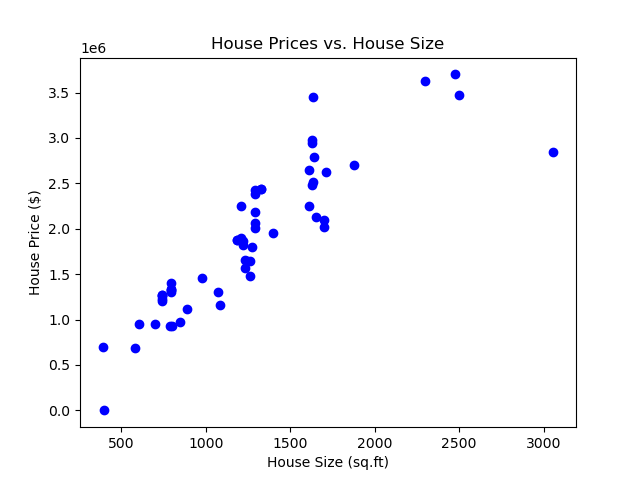
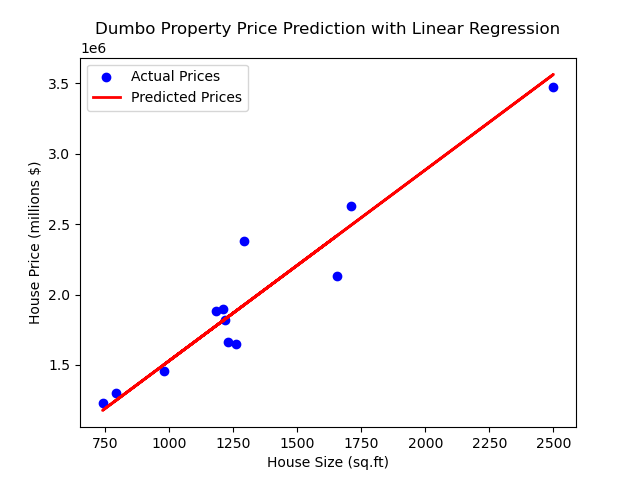

# Linear Regression Housing Project 

This project predocts house prices based on house size using a simple linear regression model in python. The dataset contains house sizes and their corresponding prices, and the model is trained to predict prices fromt the size.

# Results
### Scatter Plot of House Prices vs. House Size

### Regression Line Predictions 

## How to Run
1. Open 'hmodelregression.ipynb' in Jupyter Notebook / VsCode.
2. Run all cells to see the analysis, plots, and predictions.
